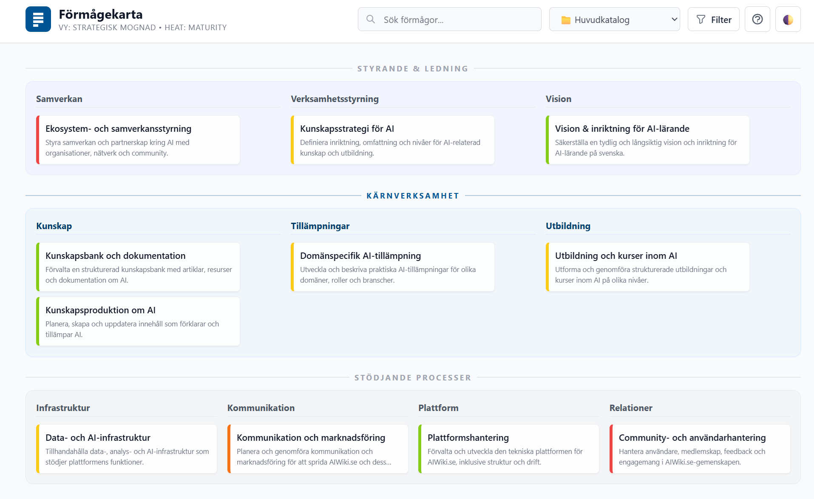

# Capability Map App

En fullständig Enterprise Architecture capability map-applikation byggd med PHP och Markdown.



[](https://opensource.org/licenses/MIT)
[](https://php.net)

## ⚡ Snabbstart

```bash
# Klona och starta lokalt
git clone https://github.com/yllemo/capability-map-app.git
cd capability-map-app

# Starta utvecklingsserver
php -S localhost:8080

# Öppna i webbläsare
open http://localhost:8080/view/index.php
```

**⚠️ VIKTIGT**: Ändra lösenord i `config/auth.php` innan du kör i produktion!

## Funktioner

### Viewer (`/view/index.php`)
- 📊 Interaktiv förmågekarta med layers och områden
- 🔍 Sök och filter på mognadsgrad (1-5)
- 🎨 Heat visualization med färgkodning (maturity/criticality)
- 🌓 Dark/Light mode med automatisk tema-ihågkommelse
- 📸 PNG-export av kartan
- 📤 Excel-export med valmöjlighet: aktuell katalog eller alla kataloger
- 📁 Multi-folder support - växla mellan olika innehållskataloger
- 🔗 Auto-linking av capability-referenser (cap-xxx) i markdown
- 📱 Mobiloptimerad med icke-sticky headers på mobila enheter
- 🎨 Konfigurerbar UI via config-filer (texter och logo)

### Editor (`/editor/index.php`)
- ✏️ Markdown-editor med live preview
- 📝 YAML frontmatter-redigering
- ➕ Skapa nya capabilities
- 🗑️ Radera filer med bekräftelse
- ✏️ Byt namn på filer
- 💾 Ladda ner enskilda filer eller hela foldern som ZIP
- 📁 Skapa och hantera flera content-folders
- ⚠️ Varning vid osparade ändringar
- ✅ Success/error feedback-meddelanden
- 🛡️ Validering av duplicerade ID:n

### Säkerhet
- 🔐 Session-baserad autentisering för editor
- 🛡️ CSRF-skydd på alla formulär
- 🔒 Säker session-konfiguration (httponly, samesite, secure)
- 📝 Audit logging av alla ändringar
- ⚠️ Varning vid användning av standardlösenord
- 🚫 Path traversal-skydd med PathGuard
- 🐳 OpenShift/Kubernetes-kompatibilitet med automatisk miljödetektering

## Kom igång (lokalt)

```bash
php -S localhost:8080
```

Öppna:
- **Viewer**: http://localhost:8080/view/index.php
- **Editor**: http://localhost:8080/editor/index.php

### Första gången
1. **VIKTIGT**: Ändra lösenord i `/config/auth.php` 
   ```php
   'editor_password' => 'ÄNDRA-TILL-SÄKERT-LÖSENORD-HÄR',
   ```
2. Logga in på editorn: http://localhost:8080/editor/index.php
3. Börja skapa eller redigera capabilities

> 🔐 **Säkerhetstips**: Använd minst 32 tecken långt slumpmässigt lösenord för produktion!

## Konfiguration

### Auth (`/config/auth.php`)
```php
'editor_password' => 'ditt-säkra-lösenord-här',  // Ändra detta!
'cookie_name' => 'capmap_editor',
'cookie_ttl' => 60 * 60 * 8,  // 8 timmar
```

### App (`/config/app.php`)
```php
'site_name' => 'Capability Maps',
'base_path' => '',  // ex. '/capapp' om hostad i subfolder
'timezone' => 'Europe/Stockholm',

// Multi-folder support
'content_dirs' => [
  'content' => [
    'path' => __DIR__ . '/../content',
    'label' => 'Huvudkatalog',
    'description' => 'Standard förmågekartor',
  ],
  // Lägg till fler folders här
],
```

### Taxonomi (`/config/taxonomy.php`)
Definiera layers, types, och levels för din organisation.

### View (`/config/view.php`)
Styr visualisering och layout:
```php
'heat_field' => 'maturity',    // 'maturity' | 'criticality' | 'risk_level'
'show_empty_lanes' => true,    // Visa tomma sektioner
'layout' => [
  'max_columns_sm' => 2,       // Max kolumner på mobil
  'max_columns_md' => 3,       // Max kolumner på tablet
  'max_columns_lg' => 4,       // Max kolumner på desktop
],
```

### UI Konfiguration (`/config/ui.php`)
Anpassa texter och logo för applikationen:
```php
'title' => 'Förmågekarta',                    // Huvudtitel
'subtitle' => 'Vy: Strategisk mognad',        // Undertitel  
'heat_label' => 'heat',                       // Heat-etikett
'search_placeholder' => 'Sök förmåga...',     // Sökfält placeholder
'filter_button_text' => 'Filter',             // Filterknappstext
'export_excel_text' => 'Exportera till Excel', // Excel-knappstext

// Custom SVG-logo
'logo' => [
  'svg_file' => 'min-logo.svg',  // Lägg SVG i /config/
  'fallback_text' => 'EA',       // Text om ingen SVG
  'svg_width' => '40',
  'svg_height' => '40'
],
```

**Heat Field**: Bestämmer vilken property som styr kantfärgen på förmågekorten:
- `'maturity'` - Mognadsnivå (standard) 
- `'criticality'` - Kritikalitet för verksamheten
- `'risk_level'` - Custom risk-fält (om du lägger till det)

## Frontmatter (YAML)

```yaml
---
id: cap-hr-001
name: Lönehantering
layer: karnprocesser
area: HR
level: 2
type: verksamhetsformaga
description: Hanterar löneprocessen från A till Ö
owner: HR-chef
status: aktiv
maturity: 3
criticality: 4
tags: [hr, lön, process]
updated: 2025-12-30
---

# Lönehantering

Markdown-innehåll här med full support för:
- Listor (ordered och unordered)
- **Fetstil** och *kursiv*
- `Kod` och kodblock
- > Citat
- [Länkar](https://example.com)
- Auto-linking till andra capabilities (cap-hr-002)
```

## 📊 Maturity & Criticality

### Maturity (Mognadsnivå)
Indikerar hur väl utvecklad och strukturerad en förmåga är:

- **1 (Initial)** - Ad-hoc, ostrukturerat, reaktivt
- **2 (Repeatable)** - Vissa rutiner finns, inte dokumenterat
- **3 (Defined)** - Dokumenterade processer, standarder följs
- **4 (Managed)** - Mäts och följs upp, kvantifierad styrning
- **5 (Optimizing)** - Kontinuerlig förbättring, innovation

**Visualisering**: 
- 🟥 Röd kantfärg (nivå 1-2) - Behöver uppmärksamhet
- 🟨 Gul kantfärg (nivå 3) - Acceptabel
- 🟩 Grön kantfärg (nivå 4-5) - Bra/Excellent

**Filter**: Klicka på färgade cirklar under sökrutan för att filtrera på mognadsnivå.

### Criticality (Kritikalitet)
Indikerar hur viktig förmågan är för verksamheten:

- **1** - Låg påverkan på verksamheten
- **2** - Måttlig påverkan
- **3** - Viktig för normal drift
- **4** - Kritisk för verksamheten
- **5** - Avgörande för överlevnad

**Konfiguration**: Ändra heat-visualisering i `/config/view.php`:
```php
'heat_field' => 'criticality',  // Växla från maturity till criticality
```

**Metadata-visning**: Både maturity och criticality sparas, men:
- **Maturity** visas som "M3" i små badges under förmågans namn
- **Criticality** används som alternativ heat-visualisering (kantfärg)
- Båda är synliga i editorn för redigering

**Tips**: Använd maturity för operativ utveckling och criticality för strategisk prioritering.

## 🆕 Senaste uppdateringar

### Excel Export
- **Valmöjlighet**: Exportera endast aktuell katalog eller alla kataloger
- **Dropdown-meny**: Enkelt val mellan export-alternativ
- **Katalog-kolumn**: När alla kataloger exporteras visas vilken katalog varje förmåga kommer ifrån
- **Intelligent namngivning**: Filnamnet reflekterar vad som exporterats

### Mobilanpassningar
- **Icke-sticky headers**: Headers scrollar med innehållet på mobila enheter för mer skärmyta
- **Responsiv dropdown**: Export-dropdown öppnas uppåt på små skärmar
- **Touch-optimerad**: Förbättrad användarupplevelse på touchskärmar

### UI Konfiguration
- **Anpassningsbara texter**: Ändra alla synliga texter via `/config/ui.php`
- **Custom logo**: Använd egen SVG-logo istället för "EA"-texten
- **Klickbar header**: Logo och titel är klickbara för att komma tillbaka till startsidan
- **Fallback-hantering**: Smidig övergång mellan SVG-logo och textfallback

### OpenShift/Kubernetes Support
- **Automatisk miljödetektering**: Detekterar container-miljöer automatiskt
- **Session-kompatibilitet**: Anpassade cookie-inställningar för containeriserade miljöer
- **Temp-directory fallbacks**: Intelligent hantering av skrivbara temp-kataloger
- **Debug-endpoints**: `/view/debug_session.php` och `/view/reset_session.php` för felsökning

## Multi-folder support

Växla mellan olika innehållskataloger (t.ex. produktion, test, arkiv):

1. Lägg till i `config/app.php`:
```php
'content_dirs' => [
  'content' => [
    'path' => __DIR__ . '/../content',
    'label' => 'Produktion',
    'description' => 'Produktionsdata',
  ],
  'test' => [
    'path' => __DIR__ . '/../test',
    'label' => 'Test',
    'description' => 'Testmiljö',
  ],
],
```

2. Skapa mappen: `mkdir test`

3. Dropdown visas automatiskt i både viewer och editor

## Filstruktur

```
/content/               # Markdown-filer (capabilities)
  /ledning_styrning/
  /karnprocesser/
  /verksamhetsstod/
/editor/               # Editor-interface
/view/                 # Viewer-interface
/app/                  # Backend-logik
  /lib/                # Klasser (Repository, Markdown, etc.)
  /templates/          # Layout-templates
/config/               # Konfigurationsfiler
  ui.php               # UI-texter och logo-konfiguration
  auth.php             # Autentisering
  app.php              # Allmänna inställningar
  taxonomy.php         # Kategorier och taxonomi
  view.php             # Visualisering och layout
/storage/              # Logs och temp-filer
/assets/               # CSS, JS, ikoner
OPENSHIFT_TROUBLESHOOTING.md    # OpenShift-felsökning
UI_KONFIGURATION.md            # UI-konfigurationsguide
```

## Säkerhet & Best Practices

- ✅ Använd HTTPS i produktion
- ✅ Ändra standardlösenord omedelbart
- ✅ Säkerhetskopiera `/content` regelbundet
- ✅ Granska `/storage/error.log` för fel
- ✅ Begränsa åtkomst till `/editor` med .htaccess eller brandvägg
- ✅ Använd starka lösenord (minst 32 tecken)

## Loggar

Alla editor-operationer loggas i `/storage/error.log`:
- Skapande av capabilities
- Uppdateringar
- Borttagningar
- Namnbyten
- Folder-skapande

Format: `[YYYY-MM-DD HH:MM:SS] AUDIT: action (user: xxx) {context}`

## Deployment

### Apache
```apache
<VirtualHost *:80>
    ServerName yourdomain.com
    DocumentRoot /var/www/capability-map
    <Directory /var/www/capability-map>
        AllowOverride All
        Require all granted
    </Directory>
    
    # Skydda känsliga kataloger
    <Directory /var/www/capability-map/storage>
        Require all denied
    </Directory>
    <Directory /var/www/capability-map/config>
        Require all denied
    </Directory>
</VirtualHost>
```

### Nginx
```nginx
server {
    listen 80;
    server_name yourdomain.com;
    root /var/www/capability-map;
    index index.php;

    location / {
        try_files $uri $uri/ /index.php?$query_string;
    }

    location ~ \.php$ {
        fastcgi_pass unix:/var/run/php/php8.2-fpm.sock;
        fastcgi_index index.php;
        include fastcgi_params;
    }
    
    # Skydda känsliga filer
    location ~ ^/(storage|config|\.git) {
        deny all;
        return 404;
    }
}
```

### Säkerhet
- Ändra lösenord i `config/auth.php` innan deployment
- Sätt korrekta filrättigheter: `chmod -R 755 ./ && chmod -R 700 storage/`
- Använd HTTPS i produktion
- Säkerhetskopiera `content/` regelbundet

## 📖 Bakgrund och filosofi

Problemet med förmågekartor är sällan att skapa dem - det är att hålla dem vid liv. De flesta förmågekartor tas fram i workshops, dokumenteras i PowerPoint och glöms bort inom sex månader.

Capability Map App bygger på en annan filosofi: **innehåll före verktyg**. Genom att använda Markdown-filer istället för databaser blir förmågor:
- **Läsbara** utan verktyg
- **Versionshanterade** med Git
- **AI-kompatibla** för analys och automation
- **Långsiktiga** och flyttbara mellan system

När förmågor behandlas som text blir uppdatering enkel, förändring spårbar och utveckling möjlig.

**📝 Läs mer**: [Förmågekartor som lever - Varför Markdown och Git är framtiden för Enterprise Architecture](https://blog.yllemo.com/?p=1912)

## Licens

MIT License - använd fritt i din organisation.

## 🤝 Bidra

Vi välkomnar bidrag! Läs [CONTRIBUTING.md](CONTRIBUTING.md) för riktlinjer.

- 🐛 [Rapportera bugs](https://github.com/yllemo/capability-map-app/issues)
- 💡 [Föreslå features](https://github.com/yllemo/capability-map-app/issues)
- 🔧 [Skicka Pull Request](https://github.com/yllemo/capability-map-app/pulls)

## 📞 Support

- 📖 [Dokumentation](README.md)
- 🔒 [Säkerhetspolicy](SECURITY.md)
- 💬 [Diskussioner](https://github.com/yllemo/capability-map-app/discussions)
- 🐛 [Issue Tracker](https://github.com/yllemo/capability-map-app/issues)
