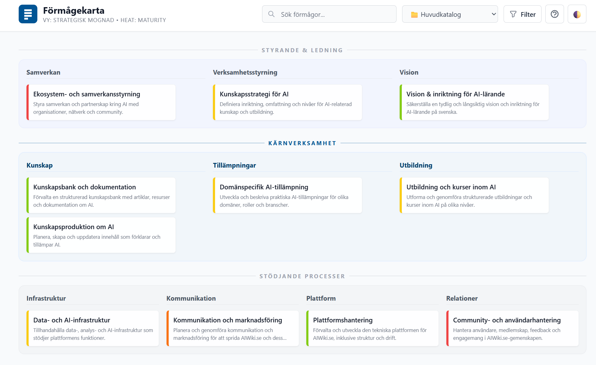

# Capability Map App

En fullständig Enterprise Architecture capability map-applikation byggd med PHP och Markdown.

## Importera JSON från capability-map-skill

Öppna editorn och välj **Importera JSON**, välj målkarta och ladda upp en fil enligt
skillens `export-html-json.md` (högst 5 MB / 2 000 förmågor).
Importen validerar hela filen och skapar en egen undermapp med Markdown-filer.
`strategic`, `core` och `support` mappas till appens skikt; `status` mappas till
`maturity` 1–5. Område sätts till `Importerade förmågor` och kan sedan redigeras.
Länkar följer med. Organisation, kartbeskrivning och övriga originalfält bevaras
i undermappens `source.json`; de ändrar inte appens globala inställningar.
Ange ett valfritt **ID-prefix**, exempelvis `cap-intra-`, för korta ID:n:
`cap-intra-1`, `cap-intra-2` och så vidare. Ett avslutande bindestreck läggs till
om det saknas. Numreringen börjar på 1 i filens ordning, oavsett originalets ID:n.
Prefixet får innehålla små bokstäver, siffror och bindestreck, börja med en bokstav
och vara högst 80 tecken. Tomt prefix behåller de automatiskt genererade ID:na.
Originalets ID sparas fortfarande som `source_id`. Prefix kan även anges vid
**+ Ny → Importera en förmåga från JSON** innan du väljer förmåga.

Befintliga förmågor skrivs inte över och samma JSON-karta med samma prefix kan inte importeras igen.
Om ett genererat ID redan finns i målkartan stoppas importen; välj då ett annat prefix.
En ändrad JSON-karta räknas som en ny import, inte som en uppdatering.

Knappen finns bara i editorn och importen använder editorns autentisering och
CSRF-skydd. Målkatalogen måste vara skrivbar för PHP. Tillfälliga importfiler
skrivs där, på samma volym som resultatet, så att import fungerar även när
`storage/` och `/content` ligger på olika volymer i OpenShift.

Exempel på en JSON-fil:

```json
{
  "version": "1.0",
  "organization": "Exempelorganisation",
  "capabilities": [
    {
      "id": 1,
      "title": "Informationshantering",
      "description": "Förmåga att strukturera och tillgängliggöra information.",
      "layer": "core",
      "status": "defined"
    }
  ]
}
```

Tillåtna statusvärden är `initial`, `developing`, `defined`, `managed` och
`optimized`. Varje förmåga behöver ett unikt positivt heltals-ID, titel,
beskrivning, skikt och status. `url` är valfritt. Felaktiga filer avvisas med
ett felmeddelande innan några förmågor sparas.



[](https://opensource.org/licenses/MIT)
[](https://php.net)

## ⚡ Snabbstart

```bash
# Klona och starta lokalt
git clone https://github.com/yllemo/capability-map-app.git
cd capability-map-app

# Starta utvecklingsserver
php -S localhost:8080

# Öppna i webbläsare
open http://localhost:8080/view/index.php
```

**⚠️ VIKTIGT**: Konfigurera säkra lösenord och API-nycklar innan produktion - se [Säkerhet](#säkerhet)!

## Funktioner

### Viewer (`/view/index.php`)
- 📊 Interaktiv förmågekarta med layers och områden
- 🔍 Sök och filter på mognadsgrad (1-5)
- 🎨 Heat visualization med färgkodning (maturity/criticality)
- 🌓 Dark/Light mode med automatisk tema-ihågkommelse
- 📸 PNG-export av kartan
- 📤 Excel-export med valmöjlighet: aktuell katalog eller alla kataloger
- 📁 Multi-folder support - växla mellan olika innehållskataloger
- 🔗 Auto-linking av capability-referenser (cap-xxx) i markdown
- 📱 Mobiloptimerad med icke-sticky headers på mobila enheter
- 🎨 Konfigurerbar UI via config-filer (texter och logo)

### Översiktsvy (`/view/overview.php`)

- Separat alternativ till den klassiska kartan med samma Markdown-innehåll.
- Färgade skiktrubriker och enkla kort med beskrivning och mognadsetikett.
- Kartväljaren finns alltid i den blå baren bredvid gränssnittsväxlaren och byter karta direkt.
- Filter och statistik är hopfällda från början; klicka på raden för att öppna.
- Sök på namn, beskrivning, ID och taggar; filtrera på skikt, område och mognad.
- Mognadsfärger: röd, gul, blå, grön och lila för nivå 1–5; grå för ej bedömd.
- Klicka på ett kort för att öppna detaljsidan. Växlaren **Klassisk / Ny vy** behåller vald karta.
- Valet sparas i webbläsaren i ett år. Startsidan och kartlänkar öppnar sedan det valda gränssnittet; utan sparat val används den klassiska vyn.
- Responsiv layout och gemensamt ljust/mörkt tema.

### Detaljvy (`/view/capability.php`)

Nedladdningsikonen bredvid **Redigera** hämtar förmågan som `.md`, inklusive
hela originalets metadata och brödtext.

### Interna länkar i Markdown-editorn

Klicka på **Infoga förmågelänk** ovanför Markdown-editorn, sök på namn, ID eller
karta och välj målet. Länktexten kan ändras; markerad text används som förslag.
Länken infogas vid markören och kan ångras i Monaco. Även reserveditorn stöds.
Spara förmågan som vanligt efter infogning.

```markdown
[Informationshantering](cap://content2/cap-info-001)
```

`cap://kartnyckel/förmåge-id` fungerar i förhandsvisningen och på detaljsidan,
även om samma ID används i flera kartor. Inga domännamn eller installationssökvägar
behöver lagras i Markdown. Befintliga `[Namn](cap-id)` och fristående `cap-id`
fortsätter använda aktuell karta med appens vanliga uppslagning.

### Referenskort mellan kartor

På **+ Ny → Länka en befintlig förmåga (referenskort)** väljer du en
originalförmåga från valfri konfigurerad karta. En minimal `.md`-fil skapas
i den aktuella kartans `references/`-katalog:

```yaml
---
id: cap-ref-eget-unikt-id
redirect_map: content2
redirect_id: cap-original-001
---
```

Kortets namn, beskrivning, metadata, taggar, skikt och område hämtas från
originalet vid visning. Referensen kan ha egna `layer`, `maturity`, `criticality`,
`risk_level` och `level` i frontmatter. De ändrar kortets placering och nivåer
utan att påverka originalet. Välj **Följ originalet** för att ta bort ett eget
värde och återgå till arv. Mognaden styr färgen i den nya vyn; klassiska vyn
använder kartans konfigurerade färgfält.

Inloggade kan öppna **Kortinställningar** direkt från referenskortet i båda
vyerna. Klick på kortets övriga innehåll öppnar originalets detaljsida. Kartnyckel och
mål-ID används för att skilja likadana ID:n i olika kartor. Om originalet
försvinner eller referenser bildar en loop visas en bruten referens.

I editorn öppnas referensfilen på en separat sida där du kan ändra mål, egna nivåer eller
ta bort referensen. Originalet påverkas inte. Vanlig metadataredigering är
spärrad för referensfiler för att behålla deras minimala format.

### Editor (`/editor/index.php`)
- ✏️ Markdown-editor med live preview
- 📝 YAML frontmatter-redigering
- ➕ Skapa nya capabilities
- 🗑️ Radera filer med bekräftelse
- ✏️ Byt namn på filer
- 💾 Ladda ner enskilda filer eller hela foldern som ZIP
- 📁 Skapa och hantera flera content-folders
- ⚠️ Varning vid osparade ändringar
- ✅ Success/error feedback-meddelanden
- 🛡️ Validering av duplicerade ID:n
- 📥 Importera JSON från capability-map-skill till vald karta
- På **+ Ny → Importera en förmåga från JSON** kan du läsa samma JSON-format,
  välja en förmåga ur filen och fylla i formuläret. Granska och ändra uppgifterna
  innan du klickar på **Skapa**. Beskrivning, mognad, länk och Markdown följer med;
  övriga förmågor i JSON-filen importeras inte.

### Gemensam favicon

Alla appens webbsidor använder `assets/favicon.svg` via
`app/templates/favicon.php`. Filens ändringstid versionsmärker adressen för
att uppdaterade ikoner ska hämtas av webbläsaren.

### Kontroller för utveckling

```bash
php tests/capability_json_import.php
php tests/frontmatter_empty_fields.php
php tests/content_migration.php
php tests/content_folders.php
php tests/capability_references.php
php tests/markdown_links.php
node --check assets/overview.js
```

PHP-testerna kontrollerar JSON-konvertering och att tomma metadatafält kan läsas
utan att bli listor. Testa även sparning, radering och vyernas layout i en
PHP-miljö innan driftsättning.

### Säkerhet
- 🔐 Session-baserad autentisering för editor
- 🛡️ CSRF-skydd på alla formulär
- 🔒 Säker session-konfiguration (httponly, samesite, secure)
- 📝 Audit logging av alla ändringar
- ⚠️ Varning vid användning av standardlösenord
- 🚫 Path traversal-skydd med PathGuard
- 🐳 OpenShift/Kubernetes-kompatibilitet med automatisk miljödetektering

## Kom igång (lokalt)

```bash
php -S localhost:8080
```

Öppna:
- **Viewer**: http://localhost:8080/view/index.php
- **Editor**: http://localhost:8080/editor/index.php

### Första gången
1. **VIKTIGT**: Kopiera och konfigurera miljöfiler:
   ```bash
   cp .env.example .env
   cp config/auth.example.php config/auth.php
   ```
2. **Redigera `.env`** och sätt säkra värden:
   ```
   EDITOR_PASSWORD=ditt-säkra-lösenord-här-minst-32-tecken
   OPENAI_API_KEY=din-openai-api-nyckel
   ```
3. Logga in på editorn: http://localhost:8080/editor/index.php
4. Börja skapa eller redigera capabilities

> 🔐 **Säkerhetstips**: Använd minst 32 tecken långt slumpmässigt lösenord för produktion!

## Konfiguration

### Auth (`/config/auth.php`)
**OBS**: Detta är en känslig fil som inte bör checkas in till Git. 
Använd miljövariabler för säker konfiguration:

```php
'editor_password' => getenv('EDITOR_PASSWORD') ?: 'fallback-lösenord',
'cookie_name' => 'capmap_editor',
'cookie_ttl' => 60 * 60 * 8,  // 8 timmar
```

Se [.env.example](.env.example) för miljövariabel-mall.

### App (`/config/app.php`)
```php
'site_name' => 'Capability Maps',
'base_path' => '',  // ex. '/capapp' om hostad i subfolder
'timezone' => 'Europe/Stockholm',

// Multi-folder support
'content_dirs' => [
  'content' => [
    'path' => __DIR__ . '/../content',
    'label' => 'Huvudkatalog',
    'description' => 'Standard förmågekartor',
  ],
  // Lägg till fler folders här
],
```

### Taxonomi (`/config/taxonomy.php`)
Definiera layers, types, och levels för din organisation.

### View (`/config/view.php`)
Styr visualisering och layout:
```php
'heat_field' => 'maturity',    // 'maturity' | 'criticality' | 'risk_level'
'show_empty_lanes' => true,    // Visa tomma sektioner
'layout' => [
  'max_columns_sm' => 2,       // Max kolumner på mobil
  'max_columns_md' => 3,       // Max kolumner på tablet
  'max_columns_lg' => 4,       // Max kolumner på desktop
],
```

### UI Konfiguration (`/config/ui.php`)
Anpassa texter och logo för applikationen:
```php
'title' => 'Förmågekarta',                    // Huvudtitel
'subtitle' => 'Vy: Strategisk mognad',        // Undertitel  
'heat_label' => 'heat',                       // Heat-etikett
'search_placeholder' => 'Sök förmåga...',     // Sökfält placeholder
'filter_button_text' => 'Filter',             // Filterknappstext
'export_excel_text' => 'Exportera till Excel', // Excel-knappstext

// Custom SVG-logo
'logo' => [
  'svg_file' => 'min-logo.svg',  // Lägg SVG i /config/
  'fallback_text' => 'EA',       // Text om ingen SVG
  'svg_width' => '40',
  'svg_height' => '40'
],
```

**Heat Field**: Bestämmer vilken property som styr kantfärgen på förmågekorten:
- `'maturity'` - Mognadsnivå (standard) 
- `'criticality'` - Kritikalitet för verksamheten
- `'risk_level'` - Custom risk-fält (om du lägger till det)

## Frontmatter (YAML)

```yaml
---
id: cap-hr-001
name: Lönehantering
layer: karnprocesser
area: HR
level: 2
type: verksamhetsformaga
description: Hanterar löneprocessen från A till Ö
owner: HR-chef
status: aktiv
maturity: 3
criticality: 4
tags: [hr, lön, process]
updated: 2025-12-30
---

# Lönehantering

Markdown-innehåll här med full support för:
- Listor (ordered och unordered)
- **Fetstil** och *kursiv*
- `Kod` och kodblock
- > Citat
- [Länkar](https://example.com)
- Auto-linking till andra capabilities (cap-hr-002)
```

## 📊 Maturity & Criticality

### Maturity (Mognadsnivå)
Indikerar hur väl utvecklad och strukturerad en förmåga är:

- **1 (Initial)** - Ad-hoc, ostrukturerat, reaktivt
- **2 (Repeatable)** - Vissa rutiner finns, inte dokumenterat
- **3 (Defined)** - Dokumenterade processer, standarder följs
- **4 (Managed)** - Mäts och följs upp, kvantifierad styrning
- **5 (Optimizing)** - Kontinuerlig förbättring, innovation

**Visualisering**: 
- 🟥 Röd kantfärg (nivå 1-2) - Behöver uppmärksamhet
- 🟨 Gul kantfärg (nivå 3) - Acceptabel
- 🟩 Grön kantfärg (nivå 4-5) - Bra/Excellent

**Filter**: Klicka på färgade cirklar under sökrutan för att filtrera på mognadsnivå.

### Criticality (Kritikalitet)
Indikerar hur viktig förmågan är för verksamheten:

- **1** - Låg påverkan på verksamheten
- **2** - Måttlig påverkan
- **3** - Viktig för normal drift
- **4** - Kritisk för verksamheten
- **5** - Avgörande för överlevnad

**Konfiguration**: Ändra heat-visualisering i `/config/view.php`:
```php
'heat_field' => 'criticality',  // Växla från maturity till criticality
```

**Metadata-visning**: Både maturity och criticality sparas, men:
- **Maturity** visas som "M3" i små badges under förmågans namn
- **Criticality** används som alternativ heat-visualisering (kantfärg)
- Båda är synliga i editorn för redigering

**Tips**: Använd maturity för operativ utveckling och criticality för strategisk prioritering.

## 🆕 Senaste uppdateringar

### Gemensam innehållsrot och valbart gränssnitt

- **Klassisk / Ny vy** ersätter länkarna mellan kartvyerna och kommer ihåg valet i webbläsaren.
- **Flytta innehåll till /content** finns i editorns sidopanel före migreringen.
  Verktyget visar källor och mål från konfigurationen innan flytten startas.
- Befintliga installationer fortsätter använda sina nuvarande kataloger tills
  migreringen körs. Att uppdatera appens kod flyttar inga innehållsfiler.
- Efter migreringen skapas nya kartkataloger under den gemensamma roten.

Se [Gemensam innehållsrot och migrering](#gemensam-innehållsrot-och-migrering)
för säkerhetskopiering, rättigheter och återställning.

### Excel Export
- **Valmöjlighet**: Exportera endast aktuell katalog eller alla kataloger
- **Dropdown-meny**: Enkelt val mellan export-alternativ
- **Katalog-kolumn**: När alla kataloger exporteras visas vilken katalog varje förmåga kommer ifrån
- **Intelligent namngivning**: Filnamnet reflekterar vad som exporterats

### Mobilanpassningar
- **Icke-sticky headers**: Headers scrollar med innehållet på mobila enheter för mer skärmyta
- **Responsiv dropdown**: Export-dropdown öppnas uppåt på små skärmar
- **Touch-optimerad**: Förbättrad användarupplevelse på touchskärmar

### UI Konfiguration
- **Anpassningsbara texter**: Ändra alla synliga texter via `/config/ui.php`
- **Custom logo**: Använd egen SVG-logo istället för "EA"-texten
- **Klickbar header**: Logo och titel är klickbara för att komma tillbaka till startsidan
- **Fallback-hantering**: Smidig övergång mellan SVG-logo och textfallback

### OpenShift/Kubernetes Support
- **Automatisk miljödetektering**: Detekterar container-miljöer automatiskt
- **Session-kompatibilitet**: Anpassade cookie-inställningar för containeriserade miljöer
- **Temp-directory fallbacks**: Intelligent hantering av skrivbara temp-kataloger
- **Debug-endpoints**: `/view/debug_session.php` och `/view/reset_session.php` för felsökning

## Multi-folder support

### Gemensam innehållsrot och migrering

Öppna **Editor → Flytta innehåll till /content** (`editor/migrate_content.php`).
Sidan läser katalogerna från konfigurationen och visar exakt vilka sökvägar som
kommer att kopieras. Kör migreringen under ett underhållsfönster, efter
säkerhetskopiering och utan andra samtidiga användare. PHP behöver endast
läsrättighet till källfilerna och skrivrättighet inne i källkatalogerna och
**`/content`** för att städa originalen efter kopieringen. Varken
root-användare eller skrivbar applikationsrot, `config/` eller `storage/` krävs
för migreringen och skapandet av kartkataloger. `/content` måste finnas i förväg
och ha plats för en extra kopia av alla kartor. I OpenShift kan den ligga på en
skrivbar persistent volym; de gamla källfilerna måste fortfarande vara synliga
för PHP när migreringen körs.

Exempel efter migrering:

```text
content/
  content/       # tidigare /content, inklusive alla undermappar och filer
  content2/      # tidigare /content2
```

Koden använder de gamla sökvägarna tills du trycker på migreringsknappen.
Verktyget kopierar via en arbetskatalog under `/content`, kontrollerar kollisioner
och SHA-256-kontrollsummor och aktiverar den nya konfigurationen sist.
Efter aktiveringen verifieras originalfilerna igen mot kopiorna och tas bort.
Tomma ursprungliga undermappar städas också, men **källornas rotkataloger tas
aldrig bort och byter aldrig namn**. Därmed kan exempelvis `/content2` vara en
monterad persistent volym som lämnas tom. `/content` behålls som innehållsrot
med de nya kartorna och konfigurationen. Filer som ändrats eller inte kan tas
bort lämnas kvar och redovisas som varningar; de nya kartorna förblir aktiva.

Vid fel före aktiveringen tas de nya kopiorna bort och originalen behålls.
Om PHP-processen avbryts: kontrollera `/content/.capmap-migration/plan.json`.
Finns `content/.capmap-config.json` är de nya kartorna redan aktiva och får
inte tas bort; kontrollera då återstående original manuellt. Annars kan
ofullständiga kopior tas bort enligt journalen före ett nytt försök, medan
originalen behålls. Namn som börjar med `.capmap-` under innehållsroten är reserverade för
verktygets konfiguration, lås och journaler.

Efter migreringen används **`content/.capmap-config.json`** i stället för `content_dirs`
i `config/app.php`. Filen är lokal och ignoreras av Git; säkerhetskopiera den ihop
med innehållet. Den innehåller `content_root` relativt applikationsroten och
`content_dirs` med `folder`, `label` och `description` per karta. Alla vyer,
editorn, import/export, AI och MCP får sökvägar via samma konfigurationsfunktioner.
Nya kartkataloger skapas via **+ Folder** i editorn under innehållsroten.
Via **Hantera folder** kan du ändra visningsnamn och katalognamn. Kartnyckeln
behålls så att referenser fortsätter fungera. Samma sida erbjuder fullständig
ZIP-backup och permanent radering av alla filer och undermappar efter att du
skrivit kartans namn som bekräftelse. ZIP-backupen inkluderar alla vanliga filer,
tomma kataloger och kartkonfiguration som arkivkommentar. Symboliska länkar
kräver separat backup. Källor i andra kartor påverkas inte, men referenser som
pekar in i den raderade kartan får ett saknat mål. Den sista kartan kan inte
raderas förrän en annan skapats. Monterade kataloger kan lämnas kvar tomma.
Befintliga kartposter bevaras i konfigurationen och den nya kartan öppnas direkt.
Om kartorna redan ligger i egna undermappar under `/content` via `config/app.php`
skapas JSON-konfigurationen automatiskt vid första nya katalogen. På äldre
installationer med kartor direkt under appens rot måste migreringen köras först.

Äldre installationer som redan använder `config/content.local.json` fungerar
fortfarande. Vid nästa skapande av en kartkatalog sparas konfigurationen under
`/content`; filen där har företräde framför den äldre konfigurationsfilen.

Test för migreringen: `php tests/content_migration.php` (använder tillfälliga testkataloger).

### Äldre konfiguration (före migrering)

Växla mellan olika innehållskataloger (t.ex. produktion, test, arkiv):

1. Lägg till i `config/app.php`:
```php
'content_dirs' => [
  'content' => [
    'path' => __DIR__ . '/../content',
    'label' => 'Produktion',
    'description' => 'Produktionsdata',
  ],
  'test' => [
    'path' => __DIR__ . '/../test',
    'label' => 'Test',
    'description' => 'Testmiljö',
  ],
],
```

2. Skapa mappen: `mkdir test`

3. Dropdown visas automatiskt i både viewer och editor

## Filstruktur

```
/content/               # Markdown-filer (capabilities)
  /ledning_styrning/
  /karnprocesser/
  /verksamhetsstod/
/editor/               # Editor-interface
/view/                 # Viewer-interface
/app/                  # Backend-logik
  /lib/                # Klasser (Repository, Markdown, etc.)
  /templates/          # Layout-templates
/config/               # Konfigurationsfiler
  ui.php               # UI-texter och logo-konfiguration
  auth.php             # Autentisering
  app.php              # Allmänna inställningar
  taxonomy.php         # Kategorier och taxonomi
  view.php             # Visualisering och layout
/storage/              # Logs och temp-filer
/assets/               # CSS, JS, ikoner
OPENSHIFT_TROUBLESHOOTING.md    # OpenShift-felsökning
UI_KONFIGURATION.md            # UI-konfigurationsguide
```

## Säkerhet & Best Practices

- ✅ Använd HTTPS i produktion
- ✅ Konfigurera `.env` med säkra värden (kopiera från `.env.example`)
- ✅ Skapa `config/auth.php` från `auth.example.php` med säkert lösenord
- ✅ **Checka ALDRIG in** `.env`, `config/auth.php` eller andra känsliga filer
- ✅ Säkerhetskopiera `/content` regelbundet
- ✅ Granska `/storage/error.log` för fel
- ✅ Begränsa åtkomst till `/editor` med .htaccess eller brandvägg
- ✅ Använd starka lösenord och API-nycklar (minst 32 tecken)

## Loggar

Alla editor-operationer loggas i `/storage/error.log`:
- Skapande av capabilities
- Uppdateringar
- Borttagningar
- Namnbyten
- Folder-skapande

Format: `[YYYY-MM-DD HH:MM:SS] AUDIT: action (user: xxx) {context}`

## Deployment

### Apache
```apache
<VirtualHost *:80>
    ServerName yourdomain.com
    DocumentRoot /var/www/capability-map
    <Directory /var/www/capability-map>
        AllowOverride All
        Require all granted
    </Directory>
    
    # Skydda känsliga kataloger
    <Directory /var/www/capability-map/storage>
        Require all denied
    </Directory>
    <Directory /var/www/capability-map/config>
        Require all denied
    </Directory>
</VirtualHost>
```

### Nginx
```nginx
server {
    listen 80;
    server_name yourdomain.com;
    root /var/www/capability-map;
    index index.php;

    location / {
        try_files $uri $uri/ /index.php?$query_string;
    }

    location ~ \.php$ {
        fastcgi_pass unix:/var/run/php/php8.2-fpm.sock;
        fastcgi_index index.php;
        include fastcgi_params;
    }
    
    # Skydda känsliga filer
    location ~ ^/(storage|config|\.git) {
        deny all;
        return 404;
    }
}
```

### Säkerhet
- ✅ Kopiera `.env.example` till `.env` och konfigurera säkra värden  
- ✅ Kopiera `config/auth.example.php` till `config/auth.php`
- ✅ Använd starka lösenord (minst 32 tecken) i `EDITOR_PASSWORD`
- ✅ Sätt korrekta filrättigheter: `chmod -R 755 ./ && chmod -R 700 storage/`
- ✅ Använd HTTPS i produktion
- ✅ Säkerhetskopiera `content/` regelbundet
- ⚠️ **Viktigt**: Checka ALDRIG in `config/auth.php` eller `.env` till Git!

## 📖 Bakgrund och filosofi

Problemet med förmågekartor är sällan att skapa dem - det är att hålla dem vid liv. De flesta förmågekartor tas fram i workshops, dokumenteras i PowerPoint och glöms bort inom sex månader.

Capability Map App bygger på en annan filosofi: **innehåll före verktyg**. Genom att använda Markdown-filer istället för databaser blir förmågor:
- **Läsbara** utan verktyg
- **Versionshanterade** med Git
- **AI-kompatibla** för analys och automation
- **Långsiktiga** och flyttbara mellan system

När förmågor behandlas som text blir uppdatering enkel, förändring spårbar och utveckling möjlig.

**📝 Läs mer**: [Förmågekartor som lever - Varför Markdown och Git är framtiden för Enterprise Architecture](https://blog.yllemo.com/?p=1912)

## Licens

MIT License - använd fritt i din organisation.

## 🤝 Bidra

Vi välkomnar bidrag! Läs [CONTRIBUTING.md](CONTRIBUTING.md) för riktlinjer.

- 🐛 [Rapportera bugs](https://github.com/yllemo/capability-map-app/issues)
- 💡 [Föreslå features](https://github.com/yllemo/capability-map-app/issues)
- 🔧 [Skicka Pull Request](https://github.com/yllemo/capability-map-app/pulls)

## 📞 Support

- 📖 [Dokumentation](README.md)
- 🔒 [Säkerhetspolicy](SECURITY.md)
- 💬 [Diskussioner](https://github.com/yllemo/capability-map-app/discussions)
- 🐛 [Issue Tracker](https://github.com/yllemo/capability-map-app/issues)
