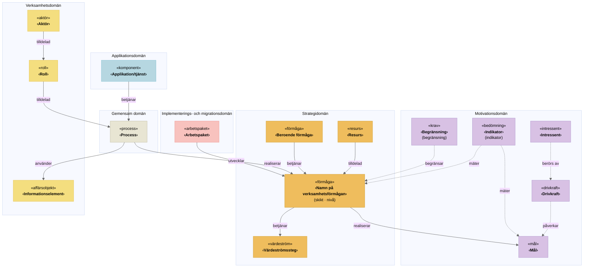

# <namn på verksamhetsförmågan>

*«förmåga» · Strategidomän*

<!--
Ifyllnadsstöd:
- Namnet ska vara ett substantiv i verksamhetsspråk, t.ex. "Löneadministration", inte "Hantera löner" eller ett systemnamn.
- Testa: "Vi har förmågan till …" ska låta meningsfullt.
- Avsnitt märkta (valfritt) kan tas bort om de inte tillför något.
-->

## Förmågebeskrivning från förmågekartan

*Vad förmågan möjliggör, i 1–3 meningar, oberoende av hur, vem eller vilket system.*

…

## Faktablock

| Egenskap | Värde |
|---|---|
| ID | … |
| Skikt | Styrande / Kärnverksamhet / Stödjande |
| Nivå | L1 / L2 / L3 |
| Överordnad förmåga | … |
| Underordnade förmågor | … |
| Status | Befintlig / Planerad / Utgående |
| Förmågeägare | … |
| Affärsvärde | Låg / Medel / Hög / Kritisk |
| Mognad nu | 1–5 |
| Mognad mål | 1–5 |
| Mognadsgap | mål − nu |

Mognadsskala (CMMI)

| Nivå | Namn | Kännetecken |
|---|---|---|
| 1 | Initial | Ad hoc, personberoende |
| 2 | Upprepbar | Dokumenterad men reaktiv |
| 3 | Definierad | Standardiserad och proaktiv |
| 4 | Kvantitativt styrd | Mäts och styrs med data |
| 5 | Optimerande | Ständig förbättring är inbyggd |

---

## Motivationsdomän

### Intressenter *(valfritt)*
*«intressent»* – de som har intresse av förmågans resultat.

- …
- …

### Drivkrafter *(valfritt)*
*«drivkraft»* – varför förmågan behövs eller behöver utvecklas, t.ex. lagkrav, politiska beslut eller omvärldsförändringar.

- …
- …

### Mål
*«mål»* – det förmågan ska bidra till.

- …
- …
- …
- …

### Indikatorer
*«bedömning»* – mått som visar hur väl förmågan uppfyller målen. Ange gärna nuläge och målvärde.

| Indikator | Nuläge | Målvärde | Kopplat mål |
|---|---|---|---|
| … | … | … | … |
| … | … | … | … |

### Begränsningar
*«krav»* – begränsningar och villkor som förmågan måste förhålla sig till, t.ex. lagstiftning, budget eller beslut.

- …
- …
- …
- …

---

## Strategidomän

### Resurser
*«resurs»* – det förmågan behöver, t.ex. kompetens, personal, budget eller avtal.

- …
- …
- …

### Värdeströmmar *(valfritt)*
*«värdeström»* – de steg i värdeströmmar som förmågan stödjer.

- …
- …

### Beroenden till andra förmågor *(valfritt)*
*«förmåga»* – förmågor som den här förmågan är beroende av eller som är beroende av den.

| Förmåga | Riktning | Kommentar |
|---|---|---|
| … | Beroende av / Stödjer | … |

---

## Gemensam domän

### Processer
*«process»* – processer som realiserar förmågan.

- …
- …
- …
- …

---

## Verksamhetsdomän

### Aktörer
*«aktör»* – organisationer eller enheter som utför förmågan.

- …
- …
- …
- …

### Roller
*«roll»* – i vilken egenskap aktörerna utför arbetet. Roller är stabilare än organisationsenheter.

- …
- …
- …

### Informationselement
*«affärsobjekt»* – information som förmågan skapar eller använder.

- …
- …
- …
- …

---

## Applikationsdomän

### Applikationer/tjänster
*«komponent»* – applikationer och IT-tjänster som stödjer förmågan.

| Applikation/tjänst | Stödjer process | Kommentar |
|---|---|---|
| … | … | … |
| … | … | … |

---

## Implementerings- och migrationsdomän

### Arbetspaket
*«arbetspaket»* – pågående eller planerade insatser som utvecklar förmågan, helst kopplade till mognadsgapet.

| Arbetspaket | Status | Bidrar till mål | Tidsperiod |
|---|---|---|---|
| … | Planerat / Pågår / Avslutat | … | … |
| … | … | … | … |

---

## ArchiMate-vy

---

## Kontrollfrågor före granskning

- [ ] Namnet är ett substantiv i verksamhetsspråk, inte ett verb, en organisationsenhet eller ett system.
- [ ] Meningen "Vi har förmågan till …" är meningsfull.
- [ ] Förmågan består även om organisationen ändras.
- [ ] Den överlappar inte syskonförmågor på samma nivå.
- [ ] Skikt, nivå, status och förmågeägare är ifyllda.
- [ ] Varje mål har minst en indikator.
- [ ] Arbetspaketen kan kopplas till mognadsgapet eller till ett mål.

---

## Mappning mot ArchiMate

| Avsnitt i mallen | ArchiMate-element | Domän |
|---|---|---|
| Namn och förmågebeskrivning | «förmåga» | Strategidomän |
| Intressenter | «intressent» | Motivationsdomän |
| Drivkrafter | «drivkraft» | Motivationsdomän |
| Mål | «mål» | Motivationsdomän |
| Indikatorer | «bedömning» | Motivationsdomän |
| Begränsningar | «krav» | Motivationsdomän |
| Resurser | «resurs» | Strategidomän |
| Värdeströmmar | «värdeström» | Strategidomän |
| Beroenden till andra förmågor | «förmåga» | Strategidomän |
| Processer | «process» | Gemensam domän |
| Aktörer | «aktör» | Verksamhetsdomän |
| Roller | «roll» | Verksamhetsdomän |
| Informationselement | «affärsobjekt» | Verksamhetsdomän |
| Applikationer/tjänster | «komponent» | Applikationsdomän |
| Arbetspaket | «arbetspaket» | Implementerings- och migrationsdomän |
