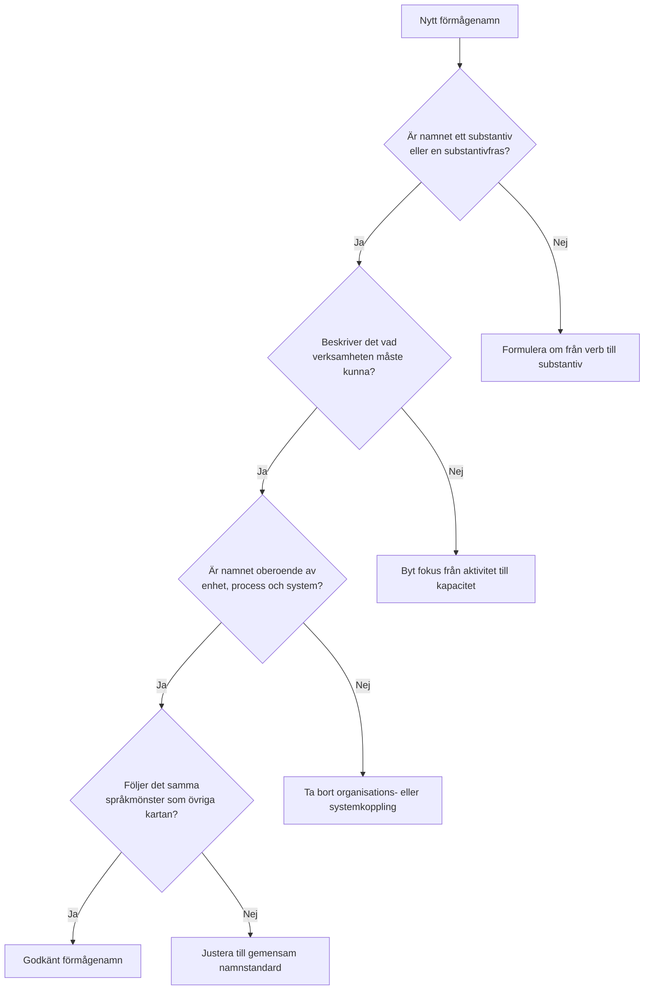

# Namngivning av förmågor i en förmågekarta

En förmågekarta blir tydligare och mer användbar när förmågor namnges konsekvent. En praktisk grundregel är att en förmåga bör uttryckas som ett substantiv eller en substantivfras. Det gör namnet stabilt över tid och mindre beroende av organisation, process eller systemstöd.

Syftet med namnet är att beskriva vad verksamheten måste kunna, inte hur arbetet utförs, vem som ansvarar för det eller vilket verktyg som används. Ett bra förmågenamn fungerar därför som en neutral och långsiktig etikett för en verksamhetskapacitet.

## Grundprincip

En förmåga bör i normalfallet kunna läsas som en sak, ett område eller en kapacitet. Det innebär att substantivform nästan alltid är att föredra framför verbform. I praktiken betyder det att namn som **Ärendehantering**, **Invånardialog** och **Informationsklassning** fungerar bättre än **Hantera ärenden**, **Prata med invånare** eller **Klassa information**.

Ett enkelt test är att pröva om namnet fungerar tillsammans med ordet *förmågan*. Om uttrycket "förmågan ärendehantering" eller "förmågan informationsklassning" känns naturligt, är namnet ofta tillräckligt välformat. Ett annat närliggande test är att fråga sig om det i princip går att sätta *en* eller *ett* framför uttrycket. Det behöver inte alltid låta perfekt i löpande text, men om ordet tydligt beter sig som ett substantiv är man oftast rätt ute.

## Vad namnet ska fånga

Ett förmågenamn ska fånga verksamhetens kapacitet på en tillräckligt hög och stabil nivå. Namnet bör därför:

- beskriva vad verksamheten måste kunna
- vara oberoende av organisationsstruktur
- vara oberoende av specifika processflöden
- vara oberoende av systemnamn, produktnamn och lokala lösningar
- vara begripligt även för personer utanför den närmaste verksamhetsdelen

Det innebär till exempel att **Ekonomistyrning** är bättre än **Ekonomienheten**, att **Identitetshantering** är bättre än **Hantera konton**, och att **Ärendehantering** är bättre än **Kontaktcenterprocessen**.

## Enkla minnesregler

Följande minnesregler fungerar väl när namn ska kvalitetssäkras:

1. Namnge förmågan som ett substantiv eller en substantivfras.
2. Beskriv vad verksamheten kan göra, inte aktiviteten i verbform.
3. Undvik namn som pekar ut en viss organisatorisk enhet.
4. Undvik namn som innehåller systemnamn eller produktnamn.
5. Välj ord som kan bestå även om processer, ansvar eller teknik förändras.
6. Sträva efter samma språkliga mönster i hela kartan.

## Tumregler för bra och mindre bra namn

| Mindre bra namn | Bättre namn | Varför det blir bättre |
|---|---|---|
| Hantera ärenden | Ärendehantering | Substantivform beskriver kapacitet snarare än aktivitet |
| Ta emot synpunkter | Synpunktshantering | Mer stabilt och lättare att placera i karta |
| Ekonomienheten | Ekonomistyrning | Beskriver förmåga, inte organisation |
| Supportteam | Användarstöd | Beskriver vad verksamheten kan leverera |
| Klassa information | Informationsklassning | Enhetlig substantivform och tydligare avgränsning |
| Hantera identiteter | Identitetshantering | Kapacitetsnamn i stället för verbfras |
| SharePoint-förvaltning | Informationssamverkan eller dokumenthantering | Frikopplar förmågan från specifik teknik |

## Rekommenderade språkmönster

Det är ofta lättast att hålla en jämn kvalitet om namngivningen följer några återkommande språkmönster. Vanliga och fungerande mönster är:

- ord på **-hantering**, till exempel Ärendehantering, Avtalshantering, Identitetshantering
- ord på **-styrning**, till exempel Informationsstyrning, Ekonomistyrning, Behörighetsstyrning
- ord på **-planering**, till exempel Bemanningsplanering, Kapacitetsplanering
- ord på **-uppföljning**, till exempel Kvalitetsuppföljning, Verksamhetsuppföljning
- ord på **-försörjning**, till exempel Kompetensförsörjning, Informationsförsörjning
- sammansatta sakord, till exempel Invånardialog, Dokumentation, Beslutsstöd

Det viktiga är inte att alla namn ser exakt likadana ut, utan att de följer samma logik. Kartan blir då lättare att läsa, förvalta och använda i dialog mellan verksamhet, arkitektur och styrning.

## Beslutsstöd i diagramform

## Praktisk rekommendation

Om målet är en enkel och hållbar standard kan följande huvudregel användas:

> Namnge förmågor som substantiv eller substantivfraser som uttrycker en långsiktig verksamhetskapacitet.

Till detta kan en kort kontrollfråga läggas till:

> Beskriver namnet vad verksamheten måste kunna, utan att låsa det till en viss enhet, process eller produkt?

Med den regeln blir det lättare att hålla ihop både kärnförmågor och mer detaljerade förmågor över flera nivåer i samma karta.